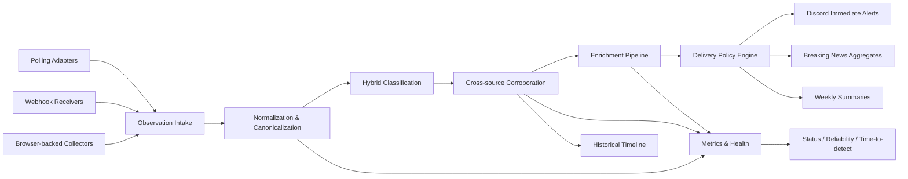

# Model Looker Bot — Feature Integration Roadmap

_Last updated: March 6, 2026_

## Why this roadmap exists

This folder turns the ideas from `BOT_IMPROVEMENT_ANALYSIS.md` into an implementation-ready architecture plan for `model_looker_bot`.

The goal is **not** to bolt on 20 features at once. The goal is to evolve the current bot from a source-centric polling bot into an **event-centric AI intelligence pipeline** that can:

- detect faster using polling, webhooks, and browser-backed collection
- classify smarter using a hybrid keyword + LLM pipeline
- corroborate signals across multiple sources instead of dropping them as duplicates
- enrich important articles into structured intelligence
- route alerts by confidence, urgency, and context
- measure how fast the bot detects signals and preserve historical timelines

## Current baseline in the repository

The plan below is designed around the code that already exists today, not around a greenfield rewrite.

### Existing architecture anchors

| Existing file | Current role | How the roadmap uses it |
|---|---|---|
| `src/index.js` | Boots Discord client, initializes DB, builds adapter list, schedules checks | Remains the main composition root; later phases add worker startup, webhook receiver startup, and event-mode bootstrapping |
| `src/services/scheduler.js` | Runs `adapter.check() -> filterItems() -> notifyItems()` on cron | Evolves into a runtime scheduler with adaptive intervals and event-aware boosts |
| `src/services/filter.js` | Keyword-only relevance gate | Becomes a hybrid classifier orchestrator with keyword fallback preserved |
| `src/services/notifier.js` | Sends directly to Discord after filtering | Becomes the delivery policy layer plus queue worker/dispatch logic |
| `src/services/digest.js` | Sends weekly paper digest and weekly roundup | Becomes an event-driven summary engine with better weekly reports |
| `src/services/http.js` | Centralized retrying HTTP requests + ArXiv pacing | Expanded into the foundation networking layer for retries, timeouts, circuit breakers, browser fallback, and crawl telemetry |
| `src/db/database.js` | SQLite schema for seen items, source status, papers, arena models, adapter state | Extended with observations, events, queue, health, enrichment, metrics, and timeline tables |
| `src/bot/channels.js` | Creates and caches Discord channels | Extended to support new channels such as `breaking-news` and `major-events` |
| `src/bot/commands.js` | Slash commands for status/sources/latest/digest | Expanded later with event-mode, health, timeline, and metrics commands |
| `src/adapters/*.js` | Source-specific polling and extraction | Preserved as the ingestion edge; adapters will emit richer observations over time |

### Current constraints that matter for planning

1. **The bot is a single-process Node.js CommonJS app**.
2. **SQLite is already the persistence layer** via `better-sqlite3`.
3. **The current runtime is poll-first**; there is no inbound webhook receiver today.
4. **Discord delivery is direct and synchronous** after filtering.
5. **The AWS deployment guide currently assumes outbound-only networking** for EC2.
6. **The project does not yet have a test framework or test suite**.
7. **The bot already has a useful `adapter_state` and `source_status` base**, which means we should evolve instead of rewrite.

## Core objective of the full feature program

The core objective is:

> **Turn raw source updates into validated, enriched, confidence-scored AI intelligence events that are delivered to the right Discord surface at the right time.**

That means the system should move from:

- “a source emitted an item”

into:

- “an event was observed from multiple sources, classified as a model release or rumor, enriched with article details, assigned a confidence level, routed according to delivery policy, and stored in a historical timeline with detection metrics”.

## Target end-state architecture

## Cross-cutting design principles

### 1. Keep the current bot working while the architecture evolves

Every phase should support **shadow mode**, **feature flags**, and **dual-write** strategies so the current Discord experience does not break while new components are introduced.

### 2. Prefer incremental evolution over a big-bang rewrite

The current scheduler, notifier, DB, and adapters are good enough starting points. The roadmap extends them step by step.

### 3. Stay SQLite-first until scale clearly demands more

Because this bot is currently single-process and already uses SQLite, the first queue, metrics store, event store, and timeline store should also be SQLite-backed.

Only consider SQS/Redis/Postgres later if one of these becomes true:

- multiple bot instances are required
- event volume grows beyond comfortable SQLite write throughput
- webhook fan-in grows significantly
- async workers need to scale independently

### 4. Use a Groq-backed hybrid intelligence model, not an LLM-only model

LLMs should improve classification and summarization, but **keyword rules must remain available as a fallback and safety net**.

For the first implementation, use **Groq directly as the sole remote LLM provider** rather than introducing Ollama Cloud, Vertex AI, or a multi-provider routing layer. The default Groq model should be **`llama-3.1-8b-instant`** because it best matches the bot's classifier/extraction workload while also giving the most practical free-plan headroom.

### 5. Separate observations from events

A single article, changelog entry, SDK bump, and playground leak may all represent the same real-world event. The system should store those as:

- **observations**: raw evidence from a single source
- **events**: a canonical grouped story or model lifecycle event

## Recommended phase map

| Phase | Goal | Features covered | Why this phase exists |
|---|---|---|---|
| Phase 1 | Reliability foundation | 14, 10, 16, 15, 17 | Makes the bot safe to extend before adding more intelligence or more load |
| Phase 2 | Faster signal acquisition | 1, 2, 3, 4, 9 | Improves detection speed and source-specific extraction quality |
| Phase 3 | Intelligence core | 5, 6, 7, 8 | Adds hybrid classification, corroboration, source scoring, and enrichment |
| Phase 4 | Delivery and UX | 11, 12, 13 | Turns events into better Discord output and weekly summaries |
| Phase 5 | Metrics and differentiation | 18, 19, 20 | Adds historical intelligence, predictive alerts, and measurable competitive edge |

## Feature-to-phase breakdown

| Feature # | Feature | Phase |
|---|---|---|
| 1 | Webhooks over polling where possible | Phase 2 |
| 2 | Adaptive polling frequencies | Phase 2 |
| 3 | Event-aware monitoring mode | Phase 2 |
| 4 | Browser-backed scraping for protected sites | Phase 2 |
| 5 | Smarter classifier with keyword fallback | Phase 3 |
| 6 | Cross-source corroboration scoring | Phase 3 |
| 7 | Source reliability scoring | Phase 3 |
| 8 | Full article enrichment pipeline | Phase 3 |
| 9 | Domain-specific extraction recipes | Phase 2 |
| 10 | Crawl health and fallback paths | Phase 1 |
| 11 | Breaking news aggregation | Phase 4 |
| 12 | Priority-aware delivery rules | Phase 4 |
| 13 | Better weekly summaries | Phase 4 |
| 14 | Shared HTTP client layer | Phase 1 |
| 15 | Queue-based notification pipeline | Phase 1 |
| 16 | Source-level health monitoring and alerting | Phase 1 |
| 17 | Test coverage for filters, dedup, extractors | Phase 1 |
| 18 | Time-to-detect metrics | Phase 5 |
| 19 | “Something is brewing” predictive alerts | Phase 5 |
| 20 | Historical model timeline | Phase 5 |

## Recommended new Discord surfaces

These additions fit the user’s note about giving major conferences or launch windows their own space.

| Channel key | Suggested display name | Purpose |
|---|---|---|
| `breaking-news` | `🚨-breaking-news` | High-confidence, aggregated, immediate alerts |
| `major-events` | `🎪-major-events` | Event-aware monitoring mode for conferences, launches, and live windows |
| `bot-status` | keep existing | Operational alerts, degraded source notices, health reports |
| `rumors-leaks` | keep existing | Low-confidence or predictive/brewing signals |

### Recommended event-mode UX

Do **not** create dozens of permanent channels for every event. Instead:

1. Add one permanent channel: `🎪-major-events`
2. When event mode activates, create a **thread per event** by default
3. Only create a dedicated full channel if the event is expected to last for days or produce extremely high volume

This keeps the server readable while still honoring the “special place for major events” requirement.

## Cross-cutting schema additions

These tables are the backbone for the later phases.

| Table | Purpose |
|---|---|
| `observations` | Raw source items after adapter extraction |
| `observation_payloads` | Optional raw JSON/HTML snapshots for debugging and replay |
| `events` | Canonical grouped intelligence events |
| `event_observations` | Many-to-many mapping from evidence to event |
| `delivery_queue` | Retryable notification jobs |
| `delivery_attempts` | Delivery history and failures |
| `crawl_attempts` | Fetch-level success/failure, transport used, latency, fallback path |
| `source_health_metrics` | Aggregated health stats per source |
| `source_reliability_scores` | Quality/freshness/reliability snapshots |
| `classifier_runs` | LLM/rule classification results, confidence, provider, failures |
| `article_enrichments` | Full-article extraction and structured metadata |
| `event_modes` | Active conference/launch monitoring windows |
| `model_entities` | Canonical model families / model identities |
| `model_timeline_events` | Lifecycle history for a model |
| `prediction_signals` | Weak signals used by “something is brewing” |
| `detection_metrics` | Detection lag, source lag, corroboration timing |

## Migration strategy across all phases

### Dual-track rollout pattern

For every major feature, use the same safe rollout pattern:

1. **Observe only**: collect data without changing user-facing behavior
2. **Shadow compare**: run the new logic alongside the old logic
3. **Controlled rollout**: enable for a subset of sources or channels
4. **Promote to default**: after metrics and false-positive reviews look healthy

### What should stay backward compatible

The following should remain stable during rollout:

- adapters still expose `check()`
- current channels continue to receive alerts until new routing is validated
- keyword filtering remains available even after LLM classification ships
- SQLite remains the primary store through all five phases

## Recommended implementation order inside the repository

1. Build Phase 1 foundations first
2. Add Phase 2 ingestion accelerators next
3. Add Phase 3 intelligence only after event/queue foundations exist
4. Upgrade delivery and summaries in Phase 4 once events are stable
5. Add metrics, predictive alerts, and timelines last in Phase 5

## Document guide

- `phase-1-foundation-reliability.md`
- `phase-2-ingestion-acceleration.md`
- `phase-3-intelligence-enrichment.md`
- `phase-4-delivery-summaries.md`
- `phase-5-metrics-predictions-timeline.md`
- `llm-classifier-provider-strategy.md`

## Final architectural recommendation

If there is one sentence to remember from the whole roadmap, it is this:

> **Do not add the 20 features as isolated patches. Add them by introducing a durable observation → event → delivery pipeline and then layering intelligence on top of it.**
